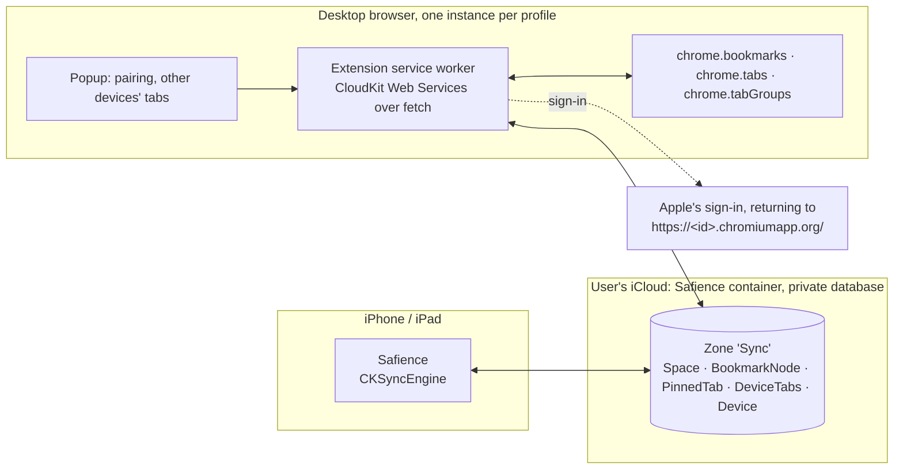

# Sync design: iCloud, tabs, cookies, and a desktop browser extension

Status: built in October 2026, as below, with what changed in the building noted where it did. The app's side is `PadCore/Sources/PadCore/SyncModel.swift` and `App/Sources/Sync.swift`; the extension is `Extension/`.

Three questions:

1. How much does the current iCloud sync hold?
2. Can open tabs and cookies sync through iCloud too?
3. How would a Chrome extension sync a desktop browser's profiles, pinned tabs, open tabs and bookmarks with Safience?

Short answers: about 10,000 to 20,000 bookmarks in all; open and pinned tabs yes, through CloudKit rather than the current store; cookies no; and the extension is best built on CloudKit, with no server of our own.

## 1. What syncs today, and how much fits

`Sync.swift` writes each space to iCloud's key-value store (`NSUbiquitousKeyValueStore`) under one key, `space.<UUID>`: its name, icon, colour and bookmarks as JSON, compressed with zlib. Removed spaces leave a small tombstone key.

Apple's limits for the key-value store ([documentation](https://developer.apple.com/documentation/foundation/nsubiquitouskeyvaluestore)):

| Limit | Value |
| --- | --- |
| All values together | 1 MB per user |
| One value | 1 MB |
| Keys | 1,024 |
| Key length | 128 UTF-16 characters (ours are 42) |
| Write rate | Coalesced and throttled by the system; meant for small, rarely changing data |

Measured with the app's JSON shape and zlib (synthetic titles and addresses, so real data compresses somewhat worse):

| Bookmarks with | Compressed size each | Fits in 1 MB |
| --- | --- | --- |
| Plain addresses | about 50 bytes | about 21,000 |
| Long addresses with query strings | about 80 bytes | about 13,000 |
| Open tabs (address, title, time) | about 100 bytes | 200 tabs take about 20 KB |

So the store holds roughly 10,000 to 20,000 bookmarks across all spaces, and up to about 1,000 spaces (keys). The real limits are elsewhere:

- **Not end-to-end encrypted.** Apple's list of what Advanced Data Protection encrypts end to end covers third-party app data only in "CloudKit encrypted fields and assets"; the key-value store isn't on it ([Apple](https://support.apple.com/en-us/102651)). Bookmarks there are encrypted at rest with Apple's keys.
- **Whole-space writes.** Each change rewrites the whole space; two devices editing one space at once keep the last write.
- **Throttled.** Fine for bookmarks; wrong for anything that changes on every page load.

## 2. Open tabs and pinned tabs: yes, through CloudKit

Tabs can sync. Their size is not the problem (100 bytes each); how often they change is. Every navigation changes a tab, which the key-value store throttles, and tabs would share its 1 MB with bookmarks.

**Move sync to the CloudKit private database with `CKSyncEngine`** (iOS 17, the app's minimum). It tracks changes, batches, retries, and wakes on push ([WWDC23](https://developer.apple.com/videos/play/wwdc2023/10188/)). Data counts against the user's own iCloud storage, which bookmarks and tabs barely touch. Fields saved through `encryptedValues` become end-to-end encrypted under Advanced Data Protection ([Apple](https://support.apple.com/en-us/102651)).

**Model: each device publishes its own open tabs; nothing mirrors them.** As Safari's iCloud Tabs does, every device writes one record per space with its open tabs, and the others show them as a list, "On Chrome · MacBook", tap to open. Mirroring live tab sets between devices would open and close tabs under the user as they browse elsewhere.

**Pinned tabs sync like bookmarks**, as part of the space, both ways: they are a chosen set, and change rarely.

What a synced tab carries: address, title, when it was last on screen, pinned or not, its space. Never page state, form contents, history or cookies. Tabs on sign-in pages, and addresses carrying credentials (`code`, `token`, `access_token`, `id_token`, `session`, `sig` in the query), are left out: an OAuth callback address can be a working credential.

## 3. Cookies: no

1. **The project's rule.** Nothing in Safience reads cookies, and `PolicyTests` enforces it. Syncing them means reading every cookie of every space with `WKHTTPCookieStore`.
2. **They are credentials.** A session cookie is a bearer token: whoever holds it is signed in. In iCloud they would sit in a store that isn't end-to-end encrypted, so one compromised Apple Account would hand over every signed-in site.
3. **They wouldn't work where it matters.** Google's Device Bound Session Credentials bind a session to a key in the device's secure hardware, so a copied cookie stops working. It is generally available in Chrome on Windows since April 2026, with macOS next ([The Hacker News](https://thehackernews.com/2026/04/google-rolls-out-dbsc-in-chrome-146-to.html), [Google](https://blog.google/security/protecting-cookies-with-device-bound-session-credentials/)). Other sites flag sessions that change browser and network at once (unverified detail).
4. **Spaces keep sign-ins apart.** Syncing cookies would cross the very isolation spaces exist for.

What carries sign-ins instead: iCloud Keychain passwords and passkeys, which Safience's browser entitlement lets pages use, and which sync end to end on Apple's side and reach Chrome through Apple's iCloud Passwords extension. Signing in again on a new device is one tap of AutoFill.

## 4. The desktop extension

Goal: a desktop browser and Safience share **profiles as spaces, pinned tabs, open tabs and bookmarks**.

### Which browsers

| Browser | Runs the extension | Notes |
| --- | --- | --- |
| Chrome, Edge, Brave, Vivaldi, Opera | Yes, Manifest V3 | One build |
| Arc, Dia | Chrome extensions run (not checked by hand) | Their own spaces aren't exposed to extensions, so profiles map, not Arc's spaces |
| Firefox | Mostly: `bookmarks` and `tabs` yes, `tabGroups` no | A second build later |
| Safari on the Mac | No | Safari's web extensions have no bookmarks API ([Apple forum](https://developer.apple.com/forums/thread/721635)) |

### How the extension reaches Safience

| Option | How | For | Against |
| --- | --- | --- | --- |
| **A. CloudKit (recommended)** | The app syncs with `CKSyncEngine`; the extension reads and writes the same private database through CloudKit Web Services | No server; the data stays in the user's iCloud; works on Windows (Apple Account sign-in on the web) | The extension signs in to the Apple Account; Apple's end-to-end encrypted fields are likely unreadable from the web (below) |
| B. A server of our own | Both sides sync with it | Any browser, full control | A service to run, pay for and secure; accounts; a bigger privacy policy |
| C. Native messaging to a Mac app | Chrome talks to a helper of a Safience Mac app, which syncs through iCloud | No web sign-in | Mac only, and needs a Mac Catalyst app: an iPad app running on a Mac can't be a native messaging host |
| D. Chrome's own sync storage | `chrome.storage.sync` | Built in | 100 KB, 8 KB an item; Safience can't read it |

### Architecture (option A)

### Sign-in and pairing

CloudKit Web Services reach a user's private database with an API token (made in CloudKit Console) plus a web sign-in token, `ckWebAuthToken`, from Apple's sign-in page ([Apple](https://developer.apple.com/library/archive/documentation/DataManagement/Conceptual/CloudKitWebServicesReference/SettingUpWebServices.html)):

- The extension opens the sign-in with `chrome.identity.launchWebAuthFlow`. Apple's page sends the token to the sign-in callback URL set in CloudKit Console: the extension's own `https://<extension-id>.chromiumapp.org/` address, which Chrome intercepts and hands to the extension. No page of ours is needed. (Built so; the first plan had a hosted callback page.)
- The token lasts 30 minutes, or two weeks with "Keep me signed in", and **changes with every request**: each response carries the next one, and the old one stops working. The service worker keeps the latest in `chrome.storage.local`. After two weeks without use the user signs in again.
- CloudKit JS can't be loaded from Apple's servers under Manifest V3, so the extension calls the REST endpoints with `fetch`.

Pairing: an extension instance runs per Chrome profile and can't see other profiles. On first run it asks which Safience space this profile is, or makes one with the profile's name, and keeps the pairing in `chrome.storage.sync`, so the same profile on another computer pairs by itself.

### Records (one custom zone, `Sync`)

| Record | Fields | Written by |
| --- | --- | --- |
| `Space` | name, icon, colour, order, deleted | Both |
| `BookmarkNode` | space, parent, position, title, address (none for a folder), modified, deleted | Both |
| `PinnedTab` | space, address, title, position, modified, deleted | Both |
| `DeviceTabs` | device, space, browser and device name, updated, tabs (address, title, pinned, group, last active) | Its device only |
| `Device` | name, kind, last seen | Its device only |

One record per bookmark rather than one per space, so two devices editing one space both keep their changes. Positions are fractional-index strings, so a move rewrites one record, not its siblings. `DeviceTabs` has a single writer, so it never conflicts; records of devices unseen for 14 days are pruned.

### Mapping

| Desktop browser | Safience |
| --- | --- |
| Profile (one extension instance) | Space |
| Bookmarks bar | The space's top-level bookmarks |
| Other bookmarks | Folder "Other Bookmarks" |
| Pinned tabs of the focused window | The space's pinned tabs |
| Open tabs of every window, with tab group names | That device's `DeviceTabs`: a list in Safience's tab overview, "On Chrome · MacBook" |
| Safience's open tabs | A list in the extension's popup, "On Safience · iPhone" |

### Sync rules

- **Bookmarks, both ways.** Chrome's bookmark events, gathered for two seconds, become record changes. Remote changes are pulled with a change token at startup, every five minutes (`chrome.alarms`, as a Manifest V3 service worker sleeps), and when the popup opens. Changes the extension applies itself are marked so their events aren't sent back. Each field takes the newest write; a deletion wins only when it is newer than the edit.
- **First pairing joins**, as `CloudSync.join` does now: bookmarks matched by address within the same folder, both sets kept, nothing deleted.
- **Pinned tabs are added, never closed.** A pinned tab from Safience opens pinned in the focused window when it is missing. A pinned tab removed elsewhere is unpinned only if nobody moved or changed it here. The extension never closes a tab.
- **Open tabs are only ever shown, never opened by themselves.**
- **Chrome Sync on two computers.** If one Chrome profile syncs across two computers and both run the extension, both would apply each remote change and Chrome Sync would copy it again. Version one makes one installation per profile the writer of remote bookmark changes, chosen through `chrome.storage.sync`; the others still send their own changes and publish their open tabs.

### Security and privacy

- **Never synced:** cookies, history, form contents, passwords, page state.
- **Extension permissions:** `bookmarks`, `tabs`, `tabGroups`, `storage`, `alarms`, `identity`, and host access to `api.apple-cloudkit.com` only. No `cookies`, no content scripts, no access to pages.
- **Encryption.** Apple's encrypted fields are end-to-end encrypted under Advanced Data Protection, but whether CloudKit Web Services can read them is undocumented; two developer forum threads asking have no answer from Apple ([2021](https://developer.apple.com/forums/thread/684385), [2026](https://developer.apple.com/forums/thread/839408)). Assume the extension can't. For end-to-end encryption that works on the web too, a later phase can add a key of our own:
  - Safience shows a pairing code once.
  - The key is kept in iCloud Keychain on Apple's side and in the extension's local storage on the desktop.
  - Every record's contents are sealed with AES-GCM (CryptoKit in the app, WebCrypto in the extension), so iCloud holds only ciphertext.
  - The cost: a lost key means pairing again, and malware on the desktop could read the key.
- **Disclosures.** The Chrome Web Store listing must disclose that tab addresses are handled ("Web history" in its terms). As we understand Apple's privacy labels, data in the user's own iCloud that the developer can't reach is not "collected"; check before release. `PRIVACY.md` must say what syncs and where.

### Phases

| Phase | What | Safience changes |
| --- | --- | --- |
| 1 | Sync moves from the key-value store to CloudKit (`CKSyncEngine`), a record per bookmark; pinned tabs sync; "Tabs on other devices" between iPhones and iPads | CloudKit capability; a migration that reads the key-value store once; `Sync.swift` rewritten; PadCore merge rules with tests |
| 2 | Extension, first version: sign-in, pairing, Chrome bookmarks and pinned tabs into the space (one way), Chrome's open tabs shown in Safience | Show `DeviceTabs` from desktop browsers |
| 3 | Both ways: bookmarks and pinned tabs to Chrome; Safience's tabs in the popup | None beyond phase 1 |
| 4 | Pairing key for end-to-end encryption; Firefox build; listings for Edge and others | Pairing code, sealed fields |

### Unknowns to settle before building

- Whether CloudKit Web Services can read `encryptedValues` (assumed not).
- CloudKit Web Services' rate limits for one user: undocumented; batch, and back off on `requestRateLimited`.
- Arc's and Dia's support for these extension APIs, by hand.

Phases 1 to 3 are built. Pinned tabs on the desktop are matched to records by address and noted as they are unpinned, rather than diffed window by window, since Chrome's pinned tabs belong to windows. Phase 4 (a pairing key for end-to-end encryption, Firefox) is not built.

Gemini (Google) gathered parts of the research behind this document: the extension APIs and quotas, browser compatibility, native messaging, and CloudKit limits. The facts the design turns on were checked against Apple's and Chrome's own pages, linked above.
